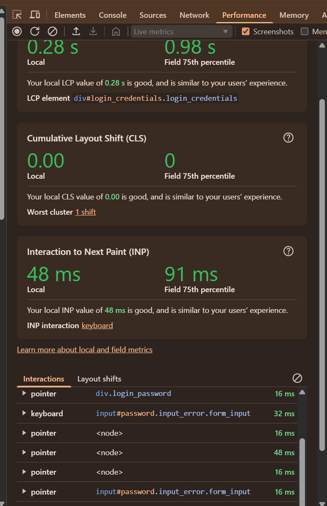
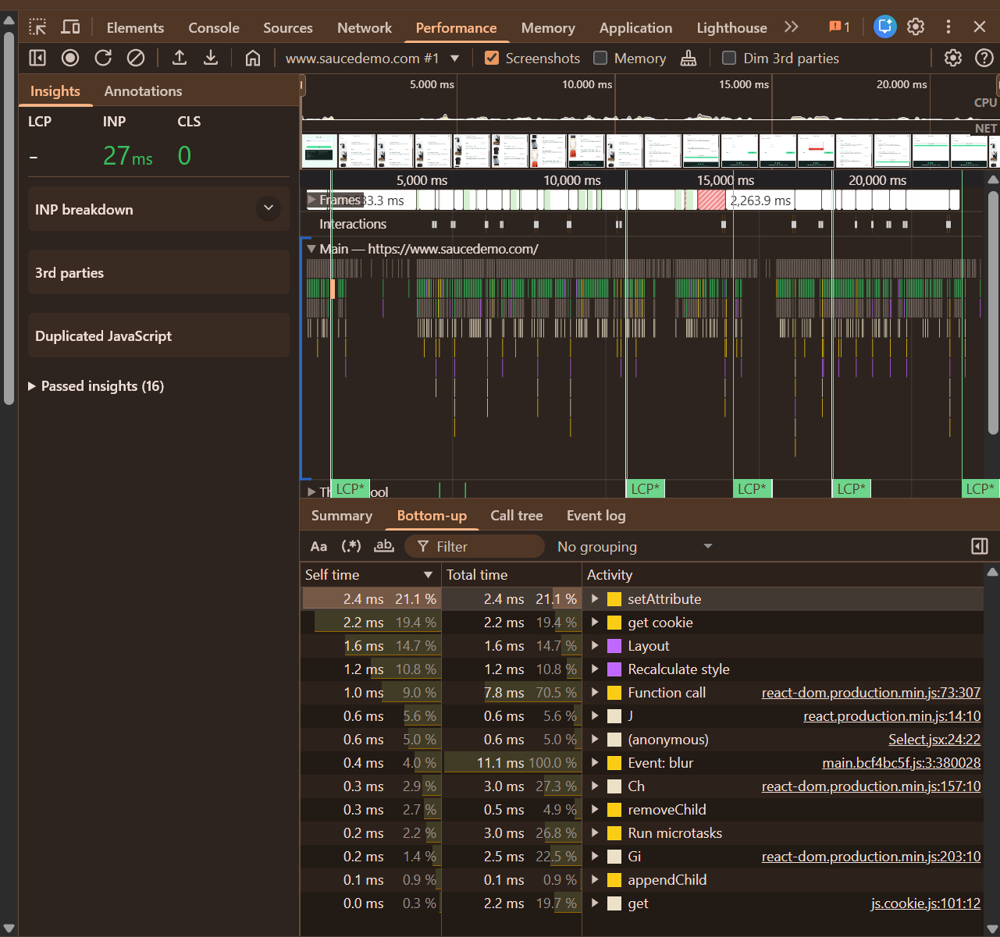
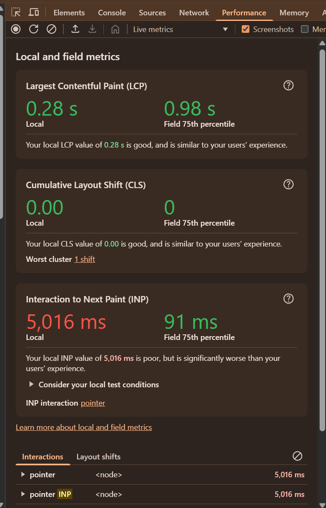
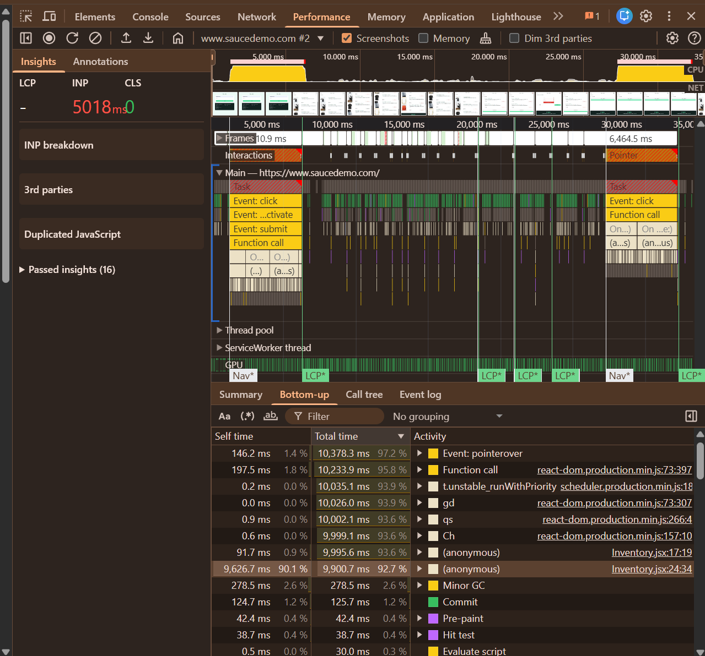

# Bug #1. Существенное снижение производительности при входе под пользователем performance_glitch_user

## Информация о дефекте

**Severity:** Major

**Priority:** Medium

**Status:** New

**Окружение:**

* Google Chrome Version 149.0.7827.103 (64-bit)
* Windows 11

---

## Описание

При входе под пользователем `performance_glitch_user` наблюдается значительное увеличение времени отклика интерфейса по сравнению с эталонным пользователем `standard_user`.

Проблема воспроизводится стабильно и подтверждается замерами производительности.

---

## Предусловия

Пользователь находится на странице авторизации SauceDemo:

https://www.saucedemo.com/

---

## Шаги воспроизведения

1. Открыть страницу авторизации SauceDemo.
2. Открыть Chrome DevTools.
3. Ввести:

   * Username: `performance_glitch_user`
   * Password: `secret_sauce`
4. Нажать кнопку **Login**.
5. Зафиксировать показатели производительности.

---

## Ожидаемый результат

Показатели производительности сопоставимы с пользователем `standard_user`.

Интерфейс реагирует без заметных задержек.

---

## Фактический результат

После входа под пользователем `performance_glitch_user` наблюдаются существенные задержки выполнения операций.

Зафиксированы следующие показатели:

| Метрика             | standard_user | performance_glitch_user |
| ------------------- | ------------- | ----------------------- |
| Login               | ~48 ms        | ~5016 ms                |
| Processing Duration | ~5.82 ms      | ~5008 ms                |
| Function Call       | ~5.74 ms      | ~5001 ms                |
| INP                 | ~30 ms        | ~5019 ms                |

Время отклика значительно превышает показатели эталонного пользователя.

---

## Вложения

### Метрики standard_user

### Метрики performance_glitch_user

