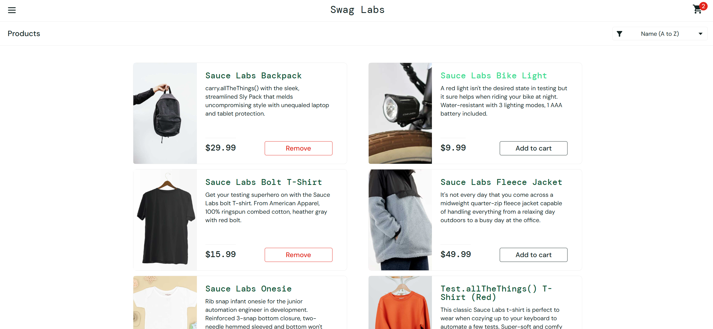
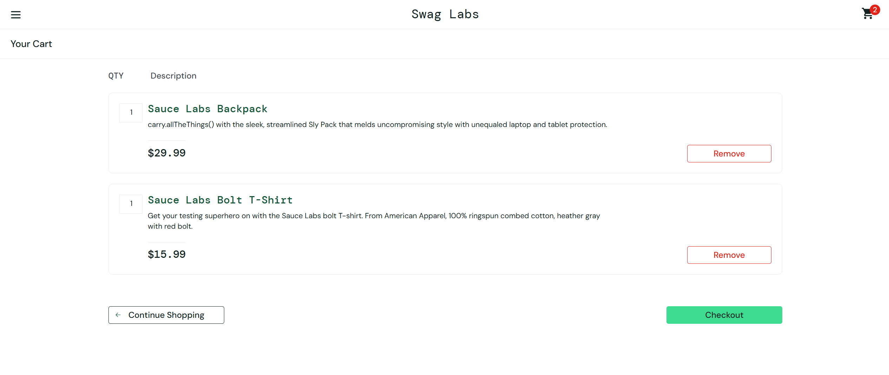
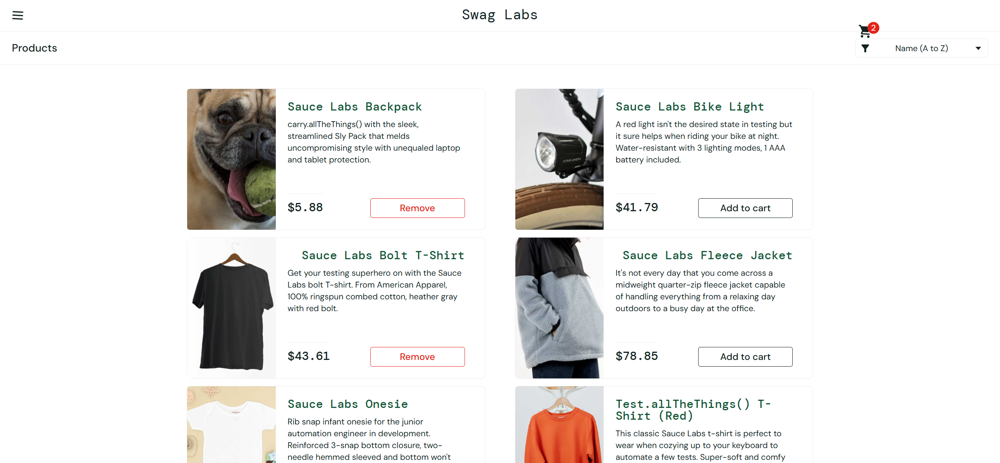
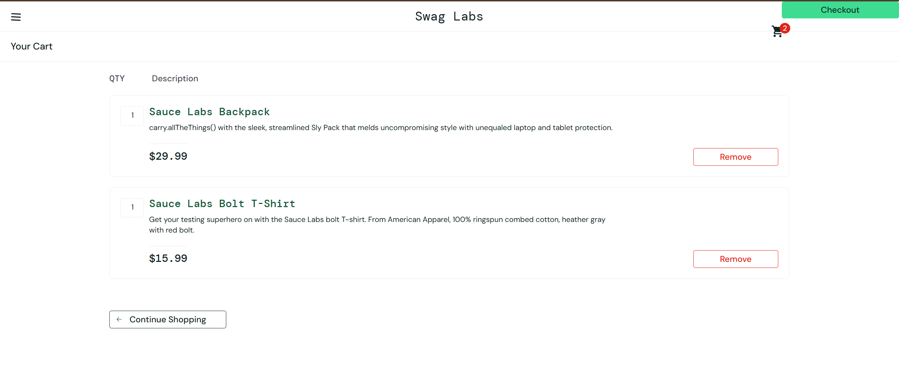

# Bug #2. Некорректное отображение изображений товаров и элементов интерфейса для пользователя visual_user

## Информация о дефекте

**Severity:** Major

**Priority:** Medium

**Status:** New

**Окружение:**

* Google Chrome Version 149.0.7827.103 (64-bit)
* Windows 11

---

## Описание

После авторизации под пользователем `visual_user` наблюдаются визуальные дефекты интерфейса по сравнению с эталонным пользователем `standard_user`.

Проблема проявляется на странице каталога товаров и странице корзины.

---

## Предусловия

Пользователь находится на странице авторизации SauceDemo:

https://www.saucedemo.com/

---

## Шаги воспроизведения

1. Открыть страницу авторизации SauceDemo.
2. Ввести:

   * Username: `visual_user`
   * Password: `secret_sauce`
3. Нажать кнопку **Login**.
4. Перейти на страницу товаров (Inventory).
5. Обратить внимание на первый товар в списке.
6. Нажать на иконку корзины.
7. Перейти на страницу корзины.

---

## Ожидаемый результат

Интерфейс отображается корректно и соответствует отображению для пользователя `standard_user`:

* каждому товару соответствует корректное изображение;
* элементы интерфейса расположены согласно макету;
* кнопка **Continue Shopping** отображается в штатной позиции.

---

## Фактический результат

На странице товаров:

* первый товар отображается с некорректным изображением;
* положение иконки корзины отличается от отображения для `standard_user`.

На странице корзины:

* кнопка **Continue Shopping** отображается со смещением в правый верхний угол страницы.

Проблема воспроизводится независимо от выбранного фильтра сортировки товаров.

---

## Дополнительная информация

Дефект носит визуальный характер и затрагивает пользовательский интерфейс приложения.

---

## Вложения

### Эталонное отображение (standard_user)

#### Страница товаров

#### Страница корзины

---

### Фактическое отображение (visual_user)

#### Страница товаров

#### Страница корзины

